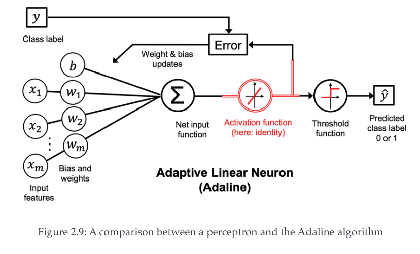

# The ADALINE (Adaptive Linear Neuron) algorithm

This is the diagram of the Adaline algorithm:

Notice one important difference between the Adaline and the Perceptron algorithm:
The error is calculated as the difference of the real class label and the output of the activation function.
If we recall, the perceptron used the real class label and the predicted label to calculate the error.

The 