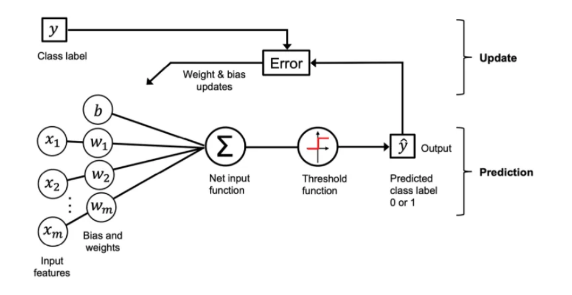
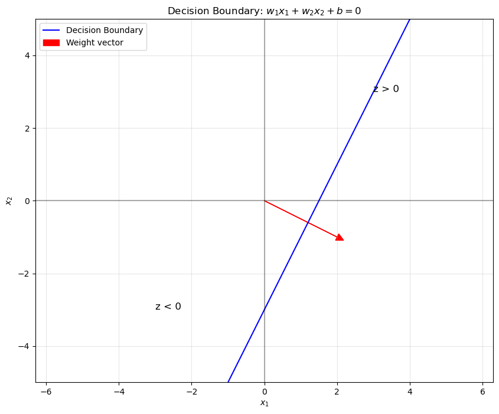
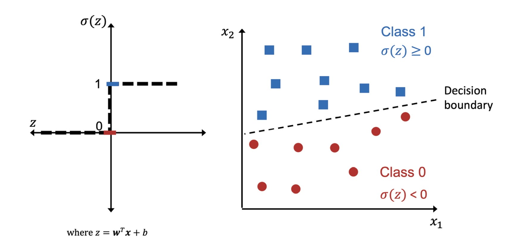

# The perceptron

 

The perceptron is one of the simplest forms of artificial neurons - think of it as a digital decision-maker that learns from examples. Just like how a biological neuron decides whether to fire based on input signals, a perceptron takes in information and makes a yes/no decision.

## How Does a Perceptron Work?
A perceptron works in three key steps:

1. **Taking Inputs**: It receives multiple input values (features), each with an associated importance (weight)
2. **Computing**: It calculates a weighted sum of these inputs
3. **Deciding**: It makes a binary decision (yes/no) based on whether this sum exceeds a threshold


## The building blocks

### 1. Inputs and weights
Think of weights as measures of importance. For example, if we're trying to decide whether to play tennis:

- Temperature (x₁) might have a large positive weight (w₁)
- Chance of rain (x₂) might have a large negative weight (w₂)
- Wind speed (x₃) might have a smaller weight (w₃)

### 2. The Net Input Function
The net input function ($z$) combines inputs and their weights:

$z = w₁x₁ + w₂x₂ + ... + wₘxₘ + b$
This is similar to calculating a weighted average, with an extra term '$b$' (bias) that shifts the decision boundary. Think of bias as the perceptron's base tendency to say yes or no.

### 3. The Decision Function
After calculating z, the perceptron makes its decision using a threshold function:
$
\sigma(z) = \begin{cases}
1 & \text{if } z \geq 0 \\
0 & \text{if } z < 0
\end{cases}
$

If z ≥ 0: Output is 1 ("yes")
If z < 0: Output is 0 ("no")


## Geometric interpretations

The concept of perceptron englobes the meaning of what an artificial neuron is. The perceptron is represented as a linear equation

$z = w_1x_1 + w_2x_2 + \dots + w_mx_m + b$ 

Where $z$ is called net input function. 

$W$ and  $X$ are column vectors that represents our weights and input features.

$$
\mathbf{w} =
\begin{bmatrix}
w_1 \\
\vdots \\
w_m
\end{bmatrix}
, \quad
\mathbf{x} =
\begin{bmatrix}
x_1 \\
\vdots \\
x_m
\end{bmatrix}
$$


## Geometric interpretations

Let's take a moment to focus on the geometric interpretation for the equation of $z. The most intuitive way to understand a perceptron is through its geometry in 2D space. There are 3 elements we need to understand about the equation:

**1. The Decision Boundary:**

The perceptron creates a straight line that divides space into two regions
Points on one side are classified as "yes", points on the other as "no"


**2. The Weight Vector:**

The weights form a vector that points perpendicular to the decision boundary
It points toward the **"yes"** region
The larger the weights, the steeper the boundary


**3. The Bias Term:**

The bias shifts the line closer to or further from the origin
Without bias, the line would always pass through the origin

The image below illustrates these elements:

 


#### The boundary decision line:
- The blue line represents the decision boundary. We obtain this line when $z=0$, by solving the equation in terms of $x_2$, being $x_1$ the independent variable. 
Similiary to our good old linear equation $y=mx+b$.

```python
# Define the line parameters
w1, w2 = 2, -1  # weights
b = -3          # bias
# Create points for the line
x1 = np.linspace(-5, 5, 100)
# From w1*x1 + w2*x2 + b = 0, solve for x2
x2 = -(w1*x1 + b)/w2
```

#### The weight vector:
The red arrow represents our Weight vector, in this case $W=\begin{bmatrix}2 \\ -1\end{bmatrix}$. There is a perpendicular relationship between the weight vector and the decision boundary line: The weight vector $W$ is always perpendicular to the decision boundary line. This means it forms a 90-degree angle with the line.

**Directional Meaning:**
The weight vector points in the direction where z (the output) increases most rapidly.
- It points toward the "`z` > 0" region
- The opposite direction points toward the "`z` < 0" region

**Mathematical Connection:**
If we have a point `P` on the line and move in the direction of the weight vector: 
- The value of `z` increases. 
- The farther we move in this direction, the larger `z` becomes

If we move in the opposite direction:
- The value of `z` decreases
- The farther we move, the more negative `z` becomes

#### The bias term
The bias on our example is$b=-3$, which means that the line is shifted 3 units away from the origin, as we can appreciate in the image.


## The learning rule of the perceptron
When using our perceptron as a classifier, the core idea is to find the best values for our weights and bias, in such a way that the decision boundary line is able to separate our data. our weights controls the slope of the line, while the bias controls the position of the line. Try to visualize how small increments of the weights and bias will change the position of the line in the plane. We need an algorithm that updates the position of the line incrementally, until the line is able to separate our data.





### steps for the perceptron learning rule

1. Initialize the weights and bias unit to 0 or small random numbers
2. For each training example, $x^{(i)}$:
    1. Compute the output value, $\hat{y}^{(i)}$
    2. Update the weights and bias unit


The perceptron updates its weights and bias after each training example using these update rules:

$w_j := w_j + \Delta w_j$
and
$b := b + \Delta b$

The update values ("deltas") are computed as follows:

$\Delta w_j = \eta(y^{(i)} - \hat{y}^{(i)})x_j^{(i)}$
and
$\Delta b = \eta(y^{(i)} - \hat{y}^{(i)})$

Where:
- $\eta$ (eta) is the learning rate
- $y^{(i)}$ is the true label for the i-th training example
- $\hat{y}^{(i)}$ is the predicted output for the i-th training example
- $x_j^{(i)}$ is the j-th feature value of the i-th training example

**Lets run a simple experiment: Imagine our model has predicted correct values**

(1) When real label is 0 and predicted label is 0:
$y^{(i)} = 0, \quad \hat{y}^{(i)} = 0, \quad \Delta w_j = \eta(0 - 0)x_j^{(i)} = 0, \quad \Delta b = \eta(0 - 0) = 0$

(2) When real label is 1 and predicted label is 1:
$y^{(i)} = 1, \quad \hat{y}^{(i)} = 1, \quad \Delta w_j = \eta(1 - 1)x_j^{(i)} = 0, \quad \Delta b = \eta(1 - 1) = 0$

**In both cases, since $(y^{(i)} - \hat{y}^{(i)}) = 0$, no weight or bias updates occur.**

However, in the case of a wrong prediction, the weights are being pushed toward the direction of the positive or negative target class:

(3) When the true label is 1 but predicted 0 (false negative):
$y^{(i)} = 1, \quad \hat{y}^{(i)} = 0, \quad \Delta w_j = \eta(1 - 0)x_j^{(i)} = \eta x_j^{(i)}, \quad \Delta b = \eta(1 - 0) = \eta$

(4) When the true label is 0 but predicted 1 (false positive):
$y^{(i)} = 0, \quad \hat{y}^{(i)} = 1, \quad \Delta w_j = \eta(0 - 1)x_j^{(i)} = -\eta x_j^{(i)}, \quad \Delta b = \eta(0 - 1) = -\eta$

In these cases, the weights and bias are updated to correct the misclassification. The learning rate η determines the size of these corrections.


# Appendix
## **Solving  $z=W^T · X$ into $y=mx+b$**
this is pretty much the same equation just written differently. 
To clarify let's first transform the  $z=W^T · X$ into $y=mx+b$.

Let's begin with $w₁x₁ + w₂x₂ + b = 0$
We can substitute $x1$ and $x2$ for $x$ and $y$ to match the standard coordinate notation, so we get:
$w_1x + w_2y + b = 0$

Lets solve for y: 

$w_2y = -w_1x - b$
(divide everything by $w_2$)
$y = - (w_1/w_2)x - b/w_2$

- The slope is $-(w_1/w_2)$
- the y-intercep is $-b/w_2$


## Relationship between bias and the decision boundary
Notice that the original decision function looks like this:

$$
 z \geq \theta 
$$

Where $\theta$ is the threshold value. This means that $z=0$> is not always the baseline for our decision boundary, but to make this simpler, we can move the threshold to the left side of the equation:

$$
 z - \theta \geq 0
$$

Which means we can rewrite our equation as:

$Z= w1x1 + ... + wmxm + b = w^Tx + \theta$


 


 
